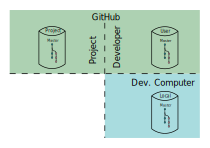

> This document defines the steps necessary to create new content
> and modify existing content in an ELISA GitHub repository, validate it,
> submit it for review and accompany it through the review process.

> People working in ELISA may come from safety certification, RTOS-based embedded product development,
> open-source software development, Linux kernel development backgrounds or combinations thereof.
> Some have extensive experience developing with git, and specifically with GitHub,
> as well as collaborating with others in such a context (black belts).
> Others, on the other hand, having only passing or no experience (white belts).

> This document aims to define the necessary steps for the black belts while giving additional information
> to aid understanding those steps for the white belts.

# Preamble

Contribution is possible from Linux-, Mac OS- and Windows-based computers
sometimes using the command line (CLI), custom tools,
integrated development environments (IDE)s
and partially with GitHub's web-based user interface (UI).
GitHub's documentation often focuses on that web-based UI.

This document focuses on using the CLI,
as it is usually the most precise and least ambiguous way to describe an action.
Note, however, that tool-supported actions can be less complicated and therefore less error-prone.

For the time being at least, identifying appropriate tools and IDE's for their platform
and mapping their operations to the git actions
is left as an exercise for the readers.

**NOTE 1:**
You cannot contribute anonymously to ELISA project repositories.
All developers must therefore have a GitHub account before starting.

**NOTE 2:**
You must sign the work that you commit.
By signing your work, you document that you are author of the work 
and have accepted the license conditions documented in the root directory of **projectRepo**.

**NOTE 3:** 
You will be expected to keep your contribution in sync with the project repository until it has been accepted.

# Terminology

The diagramme below illustrates the repository topology underlying the terminology.

{: .svgImg}

## Roles

Developer
: you

Maintainer
: People with the right to accept new contributions in the form of pull requests (PR)s

Reviewer
: Someone who either was appointed by the maintainer or has volunteered to review a PR

## Repositories

projectRepo
: the elisa-tech repository for the current activity, sometimes known as the "upstream repo"

userRepo
: the developer's repository on GitHub, in this case a fork of projectRepo

localRepo
: a clone of userRepo on the developer's computer.
This is where the development work occurs

## Branches

newFeature
: the branch on which developers work on the task at hand

master
: the branch to containing the final versions of  all contributions.
On old repositories, this branch is named "master". 
On newer repositories, there is a tendency to name it "main".

# Set up the development environment

You would need write permission to push changes from your **localRepo** directly to the **projectRepo**, which is neither advisable not generally permitted.
Instead you should use the following procedure:

## Create userRepo

Create **userRepo** by **fork**ing the **projectRepo** to your GitHub site.
Refer to [About Forks - GitHub Docs](https://help.github.com/en/github/collaborating-with-issues-and-pull-requests/about-forks?algolia-query=fork).

Note: If you activate the issue tracker in the options of **userRepo**,
developers who fork your fork (i.e. to collaborate on intermediate versions before submitting a (final) PR to the project)
will be able to create issues in **userRepo**.
Otherwise all issues created on your will be forwarded to the **projectRepo** repository instead.

##  Create and set up localRepo
If you haven't already done so, install git on your machine.
In corporate environments, the central IT department may have to install it for you.
Git is a standard package in many Linux distributions.  Otherwise you can install git with the package manager.
Windows users can install [Git for Windows](https://gitforwindows.org/).

Create a new directory for your development environment and **clone** **userRepo** to your machine, thus creating the **localRepo**.
Refer to the "GitHub.com" tab in
[Cloning a repository - GitHub Docs](https://docs.github.com/en/repositories/creating-and-managing-repositories/cloning-a-repository)
for a more detailed explanation.
As well as merely copying the code from **userRepo**, the clone operation also
effectively performs a `git init`{: language-shell .highlight}
([docu](https://git-scm.com/docs/git-init)):
* Creates .git directory in the root directory of **localRepo**: **localRepo/.git**
* Which contains, among other things a config file: **localRepo/.git/config**
* And sets a pointer to **userRepo** as the repository's remote origin repository.
  Refer to
  [About remote repositories - GitHub Docs](https://docs.github.com/en/get-started/getting-started-with-git/about-remote-repositories)
  and 
  [Managing remote repositories - GitHub Docs](https://docs.github.com/en/get-started/getting-started-with-git/managing-remote-repositories)
  for a more detailed explanation.
  
Set your user name and e-mail in your cloned repository.
Refer to [Set up Git - GitHub Docs](https://help.github.com/en/github/getting-started-with-github/set-up-git) for directions.

We recommend that you set the `git pull`{:.language-shell .highlight} command to default to `--ff-only`{:.language-shell .highlight}
as pull's default behoviour is to merge from the remote repository's master branch into the current branch.
Refer to [Why you should use git pull -ff-only](https://blog.sffc.xyz/post/185195398930/why-you-should-use-git-pull-ff-only-git-is-a)
for a detailed explanation of why this behaviour is not desirable.
Use the `git config`{:.language-shell .highlight} 
([docu](https://git-scm.com/docs/git-config))
command to set the default.
As described in 
[Set up Git - GitHub Docs](https://help.github.com/en/github/getting-started-with-github/set-up-git),
this command can set values either for the current repository (default, or with the `--local`{:.language-shell .highlight} option)
or for all repositories (with the `--global`{:.language-shell .highlight} option.
The values are stored in a **.git/config** file either at the root of **localRepo**, as mentioned above,
or in your home directory, respectively.
The appropriate command to set the default for all repositories would therefore be:
~~~ shell

$ git config --global pull.ff only

~~~

Instead of using the `git config`{:.language-shell .highlight} command, you can use your favourite text editor
to enter the corresponding entries directly.
Refer to the example conf file contents below for all recommended configuration values.

Optionally, set up a procedure to automatically sign commits.  
The currently recommended way is to use a GPG key.
Refer to [Signing commits - GitHub Docs](https://docs.github.com/en/authentication/managing-commit-signature-verification/signing-commits?query=feature+branch).  
The traditional method, which is also acceptable, is to sign with your name and e-mail, as set in the git configuration.
This means, however, that each commit must be called with the --signoff (or -s) argument.
git has no configuration parameter for automatic sign-off, but you can set an alias for your commit command.
Again, use the `git config`{:.language-shell .highlight}:
~~~~ conf

$ git config --global alias.cs commit --signoff

~~~~
and then substitute cs for the commit command, as in
~~~ bash

$ git cs -a -m "commit message"

~~~

Assuming you have used **localRepo/.git/config** for all your configuration, it should contain something like this:
~~~

[user]
  name = Your Name
  email = yourEmail@yourProvider.com
[alias]
	cs = commit --signoff

...

[remote "origin"]
	url = https://github.com/yourGitHubId/projectRepo.git
	fetch = +refs/heads/*:refs/remotes/origin/*
[branch "main"]
	remote = origin
	merge = refs/heads/main
[pull]
	ff = only

~~~

# Workflow

This section details the actions needed to create content and submit it to the project, 
which may involve basic git operations.
For a summary of the necessary git commands, refer to 
[Using git - GitHub Docs](https://docs.github.com/en/get-started/using-git).

For another explanation of what is basically being said here, refer to
[GitHub flow - GitHub Docs](https://docs.github.com/en/get-started/quickstart/github-flow).

## Create an issue

You should indicate your intention to work on **projectRepo** to the project in **projectRepo**'s issue tracker.
This serves two purposes:
1. It notifies the project that work is being done on a particular topic area.
  It therefore notifies others of potential conflicts with their work and allows
  coordinated work in areas which may conflict.
2. It gives other participants an opportunity to comment on your work before it starts.
  The issue tracker offers a forum to discuss potential problems or alternative solutions
  before work has been invested.

Either create an issue for new work or add an entry to an existing issue.

The notification should contain:
* a description of the problem (maybe just the title)
* a description of the work
* the name of the branch on which you will be working
* your name and email
* your GitHub id, which, naturally, should be there already

## Sync with projectRepo

Should the local development environment already exist,
**userRepo** and **localRepo** should contain the latest changes from **projectRepo**.
Perform Steps 1 and 2 described in the
[Periodically sync with projectRepo](#periodically-sync-with-projectrepo){: target="_self"} section below.

## Either create a newFeature branch...

The **master** branches of **userRepo** and **localRepo** should not contain
changes from the current work.
Instead they should mirror **projectRepo** in order to update your repositories with the changes that
have occurred due to accepted pull requests since you originally created the **newFeature** branch..
Refer to the next section for instructions on merging those changes
into **newFeature**.

First, ensure that the **master** branch is kept up to date.
You should pull it from **userRepo** using the --ff-only option ([docu](https://git-scm.com/docs/git-pull)).
~~~ shell

$ git checkout mastter
$ git pull origin master --ff-only

~~~

Creating a **newFeature** branch insulates your work from the rest of the project work.
Refer to 
[About branches - GitHub](https://docs.github.com/en/github/collaborating-with-pull-requests/proposing-changes-to-your-work-with-pull-requests/about-branches)
for a more detailed explanation.

Although you can create a branch with the 
`git branch`{:.language-shell .highlight} command,
([docu](https://git-scm.com/docs/git-branch)),
the `git checkout`{:.language-shell .highlight}
([docu](https://git-scm.com/docs/git-checkout)) command
can be used to switch to the new branch as well.
~~~ shell

$ git checkout -b newFeature

~~~
The new branch should be placed on **userRepo** and the **localRepo** branch should track it.
~~~ shell

$ git push -u origin newFeature

~~~

## ...or switch to the newFeature branch

Should the **newFeature** branch already exist, you need only switch to it using the
`git checkout`{:.language-shell .highlight} 
([docu](https://git-scm.com/docs/git-checkout))
command.
~~~ shell

$ git checkout newFeature

~~~

## Create content

There are any number of git operations that may be necessary during a normal write/test development cycle.
This section documents only those operations necessary to prepare the developed content for submission.
Refer to [Everyday git](https://git-scm.com/docs/giteveryday) for a short tutorial of useful commands.

### Periodically commit

Use `git status`{:.language-shell .highlight} ([docu](https://git-scm.com/docs/git-status)) to obtain lists of:
* files have changed, been marked to be committed and not been changed since (**staged**),
* files that have been marked to be committed (and are thus **tracked**) but have un-staged changes
* files in the repository that have not been marked to be committed (**untracked**)

Use `git add <filelist>`{:.language-shell .highlight} ([docu](https://git-scm.com/docs/git-add)) to track and stage files

Use `git commit`{:.language-shell .highlight} ([docu](https://git-scm.com/docs/git-commit)) to bundle a set of changed files into an atomic change.
* The -a switch automatically "adds" all changed **tracked** files, otherwise only the changes that have already been "added" are committed.
* The -s (or --signoff) switch includes your identity information (minimally you name and email from the config file) in the commit message
* The -m (--message) switch allows a commit message to be supplied as a string.
  Using this switch is not recommended as a generated commit includes the requisite information automatically.  
  When the switch is not supplied, a commit message is generated and placed in a text editor for modification.
  Close the editor to finalise the message.
  Generally, vim is used as the editor, which can be a problem for the uninitiated.

Sign the commit ([docu](https://git-scm.com/book/en/v2/Git-Tools-Signing-Your-Work)). 
Refer to the [Create and set up localRepo section](#create-and-set-up-localrepo){: target="_self"} for information 
about how to automate signing off commit.

Include a reference the relevant issue in the commit message.
Use the hashtag syntax  
`#<issue number>`{:.language-conf .highlight}
([docu](https://docs.github.com/en/github/writing-on-github/working-with-advanced-formatting/autolinked-references-and-urls#issues-and-pull-requests))
This will link the commit to the issue and make it visible in the GitHub interface.

Refer to [How to Write a Git Commit Message](https://chris.beams.io/posts/git-commit/) for good set of tips
for writing the commit message.

### Back up your work on userRepo

Use the `git push`{:.language-shell .highlight} command ([docu](https://git-scm.com/docs/git-push))
to update your remote repository.

John: Should this be git push origin newFeature
{: .comment}
~~~ shell

$ git push origin

~~~

### Periodically sync with projectRepo

As necessary, import the changes from **projectRepo** that have been merged since the last fork sync.
These changes are located on the **master** branch.
This is a two step process as follows.

#### 1) Update userRepo from projectRepo

Your fork of **projectRepo** can be synchronised in the GitHub browser interface with just one click,
provided, of course, that **localRepo**'s **master** branch has no conflicts with **projectRepo**'s **master** branch.
Refer to
[Syncing a fork from the web UI - GitHub Docs](https://docs.github.com/en/github/collaborating-with-pull-requests/working-with-forks/syncing-a-fork#syncing-a-fork-from-the-web-ui).

#### 2) Update localRepo from userRepo

Other than the content that you have changed, the content ot the **newFeature** branch
is at the **base** state.
That is, the state it was in as the branch was created
or in the state from the last merge from **userRepo/master**.

To bring updates of all branches in **userRepo** into your local development environment,
use the  
`git fetch`{:.language-shell .highlight}
([docu](https://git-scm.com/docs/git-fetch))
command.

The fetched changes must still be explicitly merged into the **newFeature** branch, however.
Since **projectMaster** contains changes that are not contained in **newFeature**,
the merge will update the base state of the branch.
Use the
`git rebase`{:.language-shell .highlight}
([docu](https://git-scm.com/docs/git-rebase))
command to merge.
~~~ shell

git rebase origin/master

~~~

Should conflicts occur, rebase will interrupt the process and give you a chance to resolve the conflict.
After the conflict has been resolved, the merge process can resume.
Refer to the [rebase documentation](https://git-scm.com/docs/git-rebase)
for a detailed description of the process and necessary commands.

Now the **newFeature** branch is based on the most recent **master** branch and
can be merged without back into the **master** branch (of **userRepo** and **projectRepo**) without conflicts.

**Note 1** This workflow means that the local version of **master** in **localRepo**
is **not** updated, but it does have the benefit that the merge operation
does not involve checking out **master** to update it and then merging
**master** into to **newFeature**.
This lessens the danger of commiting **it** instead of **newFeature**.

**Note 2** Pushing the **newFeature** branch to **userRepo** will now require
the -force switch since rebasing will change the commit history in **localRepo**.
Use
~~~ shell

$ git push origin -force

~~~

## Prepare for submission

### Validate your work

Initially, the validation procedure depends on the type of content being submitted.
Code must compile cleanly, pass unit tests and static analyses.
Textual submissions should be spell-checked.
The validation procedures should be specified by the ELISA working group responsible
for **projectRepo**.

Check that your commits have all been signed off.
Use the `git log`{:.language-shell .highlight} 
([docu](https://git-scm.com/docs/git-log))
as follows:
~~~ shell

$ git log --show-signature

~~~

In any case, the DCO checking configured in GitHub will detect unsigned commits
when you create the PR.
Should it come that far, or if you find unsigned commits with
`git log`{:.language-shell .highlight}, 
you must rebase back from the first missing commit.
If, for example, there are 10 commits between the unsigned commit
and the last commit (which is at the HEAD),
use the following command:
~~~ shell

$ git rebase HEAD-10 --signoff

~~~

Note that since this changes the history of **localRepo**, 
pushing it to **userRepo** will overwrite the changelog and 
thus require using the --force flag!

### Sync with projectRepo

The rest of the content of **newFeature** should brought up to the same state as the current version on **projectRepo**, 
if it isn't already.

How to do this is explained in  the [Periodically sync with projectRepo](#periodically-sync-with-projectrepo){: target="_self"} section above.

### Push your work to userRepo

This is explained in the [Back up your work on userRepo](#back-up-your-work-on-userrepo){: target="_self"} section above.

## Submit a PR from userRepo

Create a cross-fork PR from the **newFeature** branch on **userRepo** to the **master** branch on **projectRepo**.
* Sign the pull request.
* Include a link to (the) affected issue(s).

This can be done from the GitHub web UI.
Refer to
[Creating a pull request from a fork - GitHub Docs](https://docs.github.com/en/github/collaborating-with-pull-requests/proposing-changes-to-your-work-with-pull-requests/creating-a-pull-request-from-a-fork).

GitHub will perform a DCO check and provide instructions about how to remedy failed checks.
It provides instructions about how to sign off afterwards.
It does not always get it right, though.

**Important:** Do not continue to push revisions to **newFeature** on **localRepo** unless you want the changes
included in the PR.
The moment you push revisions to **localRepo**, the PR will be amended automatically.

The maintainer will merge **newFeature** into **master** in **projectRepo** (and delete **newFeature** from **projectRepo**?).

## Rebase userRepo, as necessary

Should the maintainer accept other pull requests before yours is accepted,
your fork may need to be rebased in order to ensure
that it can be merged without conflicts.

This is explained in the [Periodically sync with projectRepo](#periodically-sync-with-projectrepo){: target="_self"} section above.

*[CLI]: Command Line Interface
*[DCO]: Developer Certification of Origin
*[IDE]: Integrated Development Environment
*[PR]: Pull Request
*[UI]: User Interface
