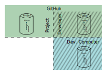

> This document defines the steps necessary to review new content submissions
> in an ELISA GitHub repository, react to review comments
> and ultimately fulfill the ELISA review requirements for incorporation into the repository.

> People working in ELISA may come from safety certification, RTOS-based embedded product development,
> open-source software development, Linux kernel development backgrounds or combinations thereof.
> Some have extensive experience developing with git, and specifically with GitHub,
> as well as collaborating with others in such a context (black belts).
> Others, on the other hand, having only passing or no experience (white belts).

> This document aims to define the necessary steps for the black belts while giving additional information
> to aid understanding those steps for the white belts.

# Preamble

In contrast to the 
[project contribution process](GitHubContributionWorkflow),
reviewing submitted content does not involve modification of the content source
and can be accomplished entirely in GitHub's web interface.

GitHub has documented the individual actions necessary for a review.
This document focuses therefore on defining which actions are advisable
in the context of the ELISA project.

**NOTE 1:**
You cannot contribute anonymously to ELISA project repositories.
All developers must therefore have a GitHub account before starting.

# Terminology

The diagram below illustrates the repository topology underlying the terminology.

{: .svgImg}

## Roles

Developer
: You, the person the submitted the pull request (PR)

Maintainer
: A person with the right to merge new contributions in the form of (PR)s
  into the **projectRepo**

Reviewer
: Someone who either was appointed by the maintainer or has volunteered to review a PR

## Repositories

projectRepo
: the elisa-tech repository for the current activity, sometimes known as the "upstream repo"

userRepo
: the developer's repository on GitHub, in this case, a fork of **projectRepo**

localRepo
: a clone of **userRepo** on teh developer's computer.
This is where the development work occurs.

## Branches

newFeature
: the branch on which the PR is located

master
: the branch to containing the final versions of  all contributions.
On old repositories, this branch is named "master". 
On newer repositories, there is a tendency to name it "main".

# Developer submits a PR

Refer to the
[project contribution workflow description](GitHubContributionWorkflow)
for instructions on how to prepare a PR and submit it to the **projectRepository**.

# Workflow

This section details the actions the repository maintainer, the reviewer(s) and the
developer should perform.

Considering that using GitHub's web interface is entirely sufficient, it might 
be enough to just refer to the GitHub documentation.
The documentation is fragemented and somewhat incomplete, however.
The documentation has a general section entitled "Review changes", 
but it does not have a link.
Refer to 
[Comment on a PR - GitHub Docs](https://docs.github.com/en/github/collaborating-with-pull-requests/reviewing-changes-in-pull-requests/commenting-on-a-pull-request).
and 
[Incorporate Feedback - GitHub Docs](https://docs.github.com/en/github/collaborating-with-pull-requests/reviewing-changes-in-pull-requests/incorporating-feedback-in-your-pull-request)
for an overview of the intended reviewer and developer actions.

This document recommends further organisational steps for the maintainer 
and addresses how the developer should process review comments in the
context of having forked **projectRepo**.

## Maintainer initiates a review

Description of enforcement of mandatory reviews
{: .todo}

### Confirm entry criteria

Are issues referenced somewhere in the pull request or the commits?
: *blah blah*{: .todo}

Have the DCO criteria been met, i.e. have the pull request and commits been properly assigned?
: *blah blah*{: .todo}

### Nominate Reviewers

Only ELISA participants with a GitHub id can perform reviews.
The default list of reviewers or assinees is derived from the list of members of "Enabling Linux in Safety Critical Applications"
who are usually those who have write permission for peoject repositories.
Additionally, contributors to the repository and commenters on the pull request maz be included.

Add the reviewers to the pull request.
Refer to 
[Requesting a pull request review - GitHub Docs](https://docs.github.com/en/github/collaborating-with-pull-requests/proposing-changes-to-your-work-with-pull-requests/requesting-a-pull-request-review)
for the corresponding documentation.

### Configure the review

Link associated issues to the pull request
: GitHub provides keywords to indicate the state of an issue when pull request is merged to the default branch.
They should be placed in the pull request description, or may be included in commit messages.
*Seems to only be possible when done by the reequester on creation*{: .todo}
Alternatively, issues can be associated to a pull request in the right sidebar of the request's screen.
Refer to 
[Linking a pull request to an issue - GitHub Docs](https://docs.github.com/en/issues/tracking-your-work-with-issues/linking-a-pull-request-to-an-issue)
for details.

Assign responsibility for the pull request
: Usually the developer would be responsible for the pull request.
Refer to
[Assigning issues and pull requests to other users - GitHub Docs](https://docs.github.com/en/issues/tracking-your-work-with-issues/assigning-issues-and-pull-requests-to-other-github-users)
for details.

## Reviewer performs review

### Initiate review tracking
* that is, start the GitHub tracking process for the reviewer's review

### Comment on changes

* GitHub doesn't seem to allow cc on comments - suggest e-mail equivalent
* Create new issues, as necessary
* and mark the changes as "viewed"

### Finish review

* Provide overall comments

* Make suggested changes mandatory, if appropriate

## Developer incorporates comments

### In web interface

### In localRepo

### Intiate further review

## Maintainer merges changes

### Verify review results sufficient
* Sufficient reviwers have responded
* Changes have been marked as viewed
* DCO criteria are fulfilled

### Merge contribution
* and delete corresponding issue(s), as appropriate

*[CLI]: Command Line Interface
*[DCO]: Developer Certification of Origin
*[IDE]: Integrated Development Environment
*[PR]: Pull Request
*[UI]: User Interface
