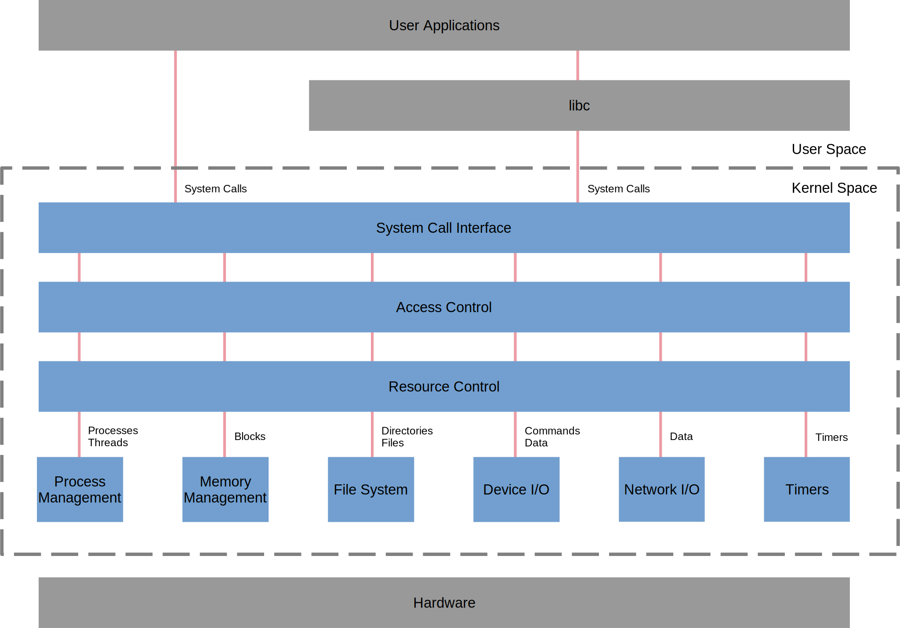

> This paper defines the architecture of the Linux operating system to aid
> the analysis of its safety integrity and ultimately to make inferences about the
> methods and techniques used in its construction.
>
> One of the essential questions that must be answered thereby is the 
> level of abstraction and granularity appropriate for modelling the essential
> structures of the architecture and their relations.

# Architectures

[ISO/IEE][iee arch] defines architecture as

Architecture
:	(system) fundamental concepts or properties of a system
	in its environment embodied in its elements, relationships,
	and in the principles of its design and evolution.

In other words, a system exhibits its fundamental characteristics
through its elements, their relationships to each other and to the 
system's environment as well as through the characteristics of its design and evolution.
These characteristics in sum define its architecture.

The [ISO/IEE][iee arch] definition differentiates between architecture,
architecture description and design,
saying that architecture is either an abstract conception of the system
or an abstract perception of the system.
Architecture is focused on the interactions between the system and its environment
whereas design is more focused inwardly.
The difference between architecture and architecture description is more difficult to determine
as the architecture description focuses on the artifacts used to express and document
architectures whereas architecture remains abstract.

In a [related document][iee archDescription], ISO/IEE details the conceptual model
behind an architectural description.
The description goes in the direction of focusing on more or less individual artifacts
and regards them under various viewpoints.
This diverges from the holistic viewpoint needed to establish the level of
abstraction and granularity appropriate for an architectural model.

For the purpose of this document, the elements expressed in the architecture represent
functionalities the operating system's environment can use to interact with it in order
to fulfil Linux' role as an operating system.
This may not be entirely abstract.

As a practical matter however, the architectural view may be the view of the system used in the conceptual
phase of the system development process to document requirements on the system.
In that phase, the properties and behaviour of the system are viewed without
particular regard for its implementation.
Note, however, that even at this stage, the specific details of its environment and the 
implementation of the environments elements (the hardware, for example) may be set.

The following sections explore Linux' fundamental elements, relationships and design
considerations.

# Linux as Operating System

Following the idea that an architecture is how a system is perceived in the abstract, 
Linux is an example of the operating system genre of computer programmes, 
as opposed to, say, a database system or an application framework.
The [Wikipedia definition of an operating system][wikipedia os] is probably an
adequate description of the common characteristics of operating systems for the purposes of this paper.
Linux furthermore has a number of attributes that classify it as a particular type of operating system.
They may dictate certain structure considerations
and are arguably fundamental elements of the abstract Linux architecture.

monolithic
:	As opposed to microkernel

multi-user, multi-tasking
:	As opposed to an RTOS that only has user and kernel space
	and single-tasking operating systems.
		
symmetric multiprocessing
:	As opposed to asymmetric multiprocessing
		
virtual memory
:	Presupposes an MMU.
	

# Elements and Relationships

The illustration below presents a functional view on Linux' architecture.
According to the [ISO/IEEE definition][iee arch], this would be a classic
software architecture, focusing on the fundamental elements and their relationships.

{: .svgImg}

All in all, in this representation Linux' functionality hardly differs
from that of a generic operating system.
Perhaps this is intuitive as operating system is a generic term and
a the essence of an architecture is that it is something which,
despite its genericity, can be recognised from its form.

## Environment

User Applications
:	User Applications are, by nature, in user space.
	In addition to having additional protection when exceptions occur,
	each application has an identity associated with it that allows Linux'
	access control and resource control functions to manage access to and
	competition for the operating system resources.
		
libc
:	libc is a standard library providing an application programming interface to the operating system.
	It sometimes passes system calls directly through to the operating system.
	Otherwise it may aggregate groups of system calls into a higher functionality
	or provide functionality, like math functions, that does not depend on the operating system.
	It too, operates in user space.
		
Hardware
:	The operating system is controls and is adapted for the hardware platform on which it operates.

## Functional Description

Linux offers access to the system's hardware peripherals and to process and memory resources to support programme execution.
It provides facilities to control access to those resources and manage them
as well as providing support services for the execution of computer programmes.

## Elements

System Call Interface
:	When called,
	the system call interface performs the context switch between user space and kernel space.

Access Control
:	Access control ensures that the application is entitled to access the system resources it has requested
	based on the identity the application has supplied.

Resource Control
:	Resource control arbitrates between applications competing for the use of system resources.
	It can deny, delay or limit applications' use of system resources based again on the identity 
	the application has supplied.
	In overload situations, resource control can revoke or limit applications' use of the resources
	to alleviate the overload.
	Resource control includes process scheduling and process allocation to hardware cores.

Process Management
:	Process management is responsible for the creation and destruction of individual processes, process groups,
	individual threads and thread groups.
		
Memory Management
:	Memory management manages UMA memory to allow applications access to memory 
	over the whole address space allowed by the word size of the underlying platform.
	It allocates pages of physical memory to applications on demand.
	The memory manager is not limited by the size of physical memory as it can store and
	retrieve pages on the file system when all of the physical memory is allocated. 

	Memory management also manages NUMA memory which is used for DMA access for the hardware.

File System
:	The file system presents a file and directory interface to permanent storage for applications.
	It stores and retrieves application data on that storage.

Device I/O
:	Devices I/O transmits commands to and receives responses from peripherals installed on the system 
	as well as storing and retrieving data from those peripherals.
		
Network I/O
:	Network I/O sends and receives data from networks connected to the system.

Timers
:	Timers provides timing facilities to be used by the applications.

# Principles of Design and Evolution

The illustration above is a purely functional view.
On the one side, Linux is an instance of a generic Unix design and has inherited or adopted 
a number of the original principles and 
also features from other open source unix or unix-like, operating systems.
On the other side, a number of its features are unique to Linux.
Nonetheless the following is an incomplete list of features that characterise Linux' design
and could be considered architecture characterising elements or architectural features:

/dev, /proc and /sys
:	Device and procedure information represented as (virtual) files
	in a filesystem realised in memory rather than persistent storage.

File System Hierarchy
:	see [Wikipedia: File System Hierarchy Standard][wikipedia filesystemhierarchy]
		
The Virtual File Interface
:	Is this a design decision?

Variability
:	Watch this space... 

	Linux was not a one-off, although the first version probably only targeted one platform
	Neither are most industrial systems.
	They may have to account for variants for different markets or market segments.
	They may have to account for hardware variation due to cost or availability situations.
	At any rate, Linux can be adapted for numerous application or security situations
	and now runs on a plethora of platforms with a further plethora of peripherals connected to the system.

	One example of an architectural construct accounting for platform variability is the virtual file interface.
	Another example is the fop descriptor in ioctl, which is probably more a design decision to cope with variability.
	Other examples may pop up.

Demand paging, copy on write
:	Is this a design decision?
		
Namespaces
:	Namespaces provide a mechanism to separate naming systems of resources,
	so that logically independent entities can access different resources with the same identifier.
	Conversely, namespaces allow parallel independent organisational structures that use the same naming structure. 

	In the context of embedded systems,
	the operating system provides a namespace system to regulate access to potentially shared resources,
	such as file systems, memory, etc.  

	There are the following namespace systems in Linux:
	* control groups (cgroups)
	* capabilities
	* user ids
	* process ids
	* mount points
	* interprocess communication
	* network (IP addresses, routing tables, socket listing, connection tracking table, firewall, etc.)
	* UTS (Host, Domain names) (UTS = Unix Timesharing System)

# Links

1. [ISO/IEE Definition of Architecture](http://www.iso-architecture.org/ieee-1471/defining-architecture.html "ISO/IEE Definition of Architecture")
2. [ISO/IEE Conceptual Model of Architecture Description](http://www.iso-architecture.org/ieee-1471/cm/ "ISO/IEE Conceptual Model of Architecture Description")
1. [IBM: Anatomy of the Linux Kernel](https://developer.ibm.com/technologies/linux/articles/l-linux-kernel/ "IBM: Anatomy of the Linux Kernel")
1. [Univ of Waterloo: Conceptual Architecture of the Linux Kernel](https://docs.huihoo.com/linux/kernel/a1/index.html "Univ of Waterloo: Conceptual Architecture of the Linux Kernel")
1. [MakeLinux: Interactive Map of the Linux Kernel]( https://makelinux.github.io/kernel/map/ "MakeLinux: Interactive Map of the Linux Kernel") Warning: slow loading...
1. [Wikipedia: File System Hierarchy Standard](https://en.wikipedia.org/wiki/Filesystem_Hierarchy_Standard "Wikipedia: File System Hierarchy Standard")
1. [Wikipedia: Linux Kernel Interfaces](https://en.wikipedia.org/wiki/Linux_kernel_interfaces "Wikipedia: Linux Kernel Interfaces")
1. [Wikipedia: Linux Kernel](https://en.wikipedia.org/wiki/Linux_kernel "Wikipedia: Linux Kernel")
1. [Wikipedia: Operating System](https://en.wikipedia.org/wiki/Operating_system "Wikipedia: Linux Kernel Interfaces")
{: .citation .bracketsAround .decimal}

[iee arch]: http://www.iso-architecture.org/ieee-1471/defining-architecture.html "ISO/IEE Definition of Architecture"
[iee archDescription]: http://www.iso-architecture.org/ieee-1471/cm/ "ISO/IEE Conceptual Model of Architecture Description"
[ibm kernelAnatomy]: https://developer.ibm.com/technologies/linux/articles/l-linux-kernel/ "IBM: Anatomy of the Linux Kernel"
[makelinux interactiveMap]:  https://makelinux.github.io/kernel/map/ "MakeLinux: Interactive Map of the Linux Kernel"
[waterloo conceptualArch]: https://docs.huihoo.com/linux/kernel/a1/index.htmli "Univ of Waterloo: Conceptual Architecture of the Linux Kernel"
[wikipedia filesystemhierarchy]: https://en.wikipedia.org/wiki/Filesystem_Hierarchy_Standard "Wikipedia: File System Hierarchy Standard"
[wikipedia kernelInterfaces]: https://en.wikipedia.org/wiki/Linux_kernel_interfaces "Wikipedia: Linux Kernel Interfaces"
[wikipedia linuxKernel]: https://en.wikipedia.org/wiki/Linux_kernel "Wikipedia: Linux Kernel"
[wikipedia os]: https://en.wikipedia.org/wiki/Operating_system "Wikipedia: Operating System"
