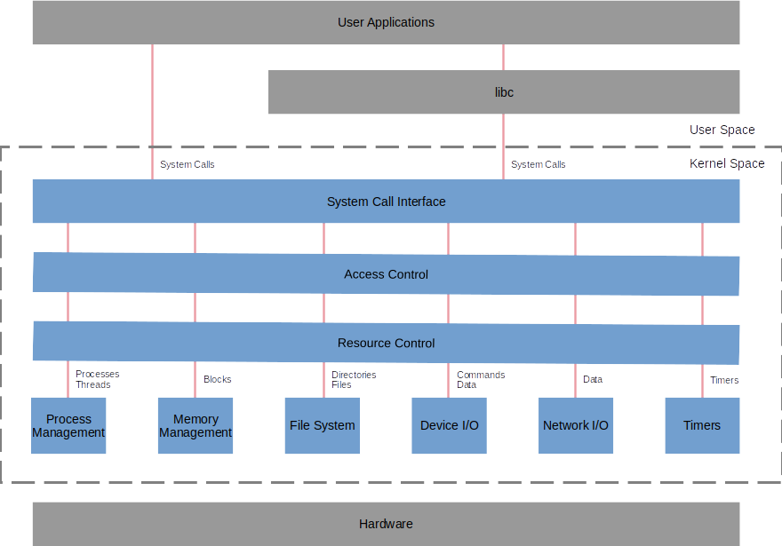

# Linux Architecture

ISO/IEE defines architecture as

<dl>
	<dt>Architecture</dt>
	<dd style="font-style: italic">
	(system) fundamental concepts or properties of a system
	in its environment embodied in its elements, relationships,
	and in the principles of its design and evolution.
	</dd>
</dl>

In other words, a system exhibits its fundamental characteristics
through its elements, their relationships to each other and to the 
system's envronment as well as characteristics of its design and evolution
that define its architecture.

The ISO/IEEE definition differentiates between architecture, architecture description
and design,
saying that architecture is either an abstract conception of the system
or an abstract perceception of the system.
Architecture is focused on the interactions between the system and its environment
whereas design is more focused inwardly.
The difference between architecture and architecture description is more difficult
as the architecture description focuses on the artifacts used to express and document
architectures whereas architecture remains abstract.

For the purpose of this document, the elements expressed in the architecture respresent
functionalities the operating system's environment can use to interact with it in order
to fulfil Linux' role as an operating system.
This may not be entirely abstract.

The following sections explore Linux' fundamental elements, relationships and design
considerations.

## Linux is an Operating System

Linux has a number of attributes that classify it as a particular type of operating system.
They may dictate certain structure considerations,
but are arguably not fundamental elements of Linux' architecture.

<dl>
	<dt>monolithic</dt>
		<dd>
		As opposed to microkernel
		</dd>
	<dt>multi-user, multi-tasking</dt>
		<dd>
		As opposed to an RTOS that only has user and kernel space
		</dd>
	<dt>symmetric multiprocessing</dt>
		<dd>
		As opposed to asymmetric multiprocessing
		</dd>
	<dt>virtual memory</dt>
		<dd>
		Presupposes an MMU.
		</dd>
</dl>

## Elements and Relationships

The illustration below presents a functional view on Linux' architecture.
According to the ISO/IEEE description, this would be a classic
software architecture, focusing on the fundamental elements and their relationships.

All in all, this representation of Linux hardly differentiates it from a generic
operating system.
Perhaps this is intuitive as operating system is a generic term and
a particular architecture is something that despite its genericity can be recognised
from its form.

### Environment

<dl>
	<dt>User Applications</dt>
		<dd>
		User Applications are, by nature, in user space.
		In addition to having additional protection when execptions occur,
		each application has an identity associated with it that allows Linux'
		access control and resource control functions to manage access to and
		competition for the operating system resources.
		</dd>
	<dt>libc</dt>
		<dd>
		libc is a standard library providing an application programming interface to the operating system.
		It sometimes passes system calls directly through to the operating system.
		Otherwise it may aggregate groups of system calls into a higher functionality
		or provide functionality, like math functions, that does not depend on the operating system.
		It too, operates in user space, and inherits the
		</dd>
	<dt>Hardware</dt>
		<dd>
		The operating system is controls and is adapted for the hardware platform on which it operates.
		</dd>
</dl>

### Elements

<dl>
	<dt>System Call Interface</dt>
		<dd>
		When called,
		the system call interface performs the context switch between user space and kernel space.
		</dd>
	<dt>Access Control</dt>
		<dd>
		Access control ensures that the application is entitled to access the system resources it has requested
		based on the identity the application has supplied.
		</dd>
	<dt>Resource Control</dt>
		<dd>
		Resource control arbitrates between applications competing for the use of system resources.
		It can deny, delay or limit applications' use of system resources based again the identity 
		the application has supplied.
		In overload situations, resource control can revoke or limit applications's use of the resources
		to alleviate the overload.
		Resource control includes process scheduling and process allocation to hardware cores.
		</dd>
	<dt>Process Management</dt>
		<dd>
		Process management is responsible for the creation and destruction of individual processes, process groups,
		individual threads and thread groups.
		</dd>
	<dt>Memory Management</dt>
		<dd>
		Memory management manages UMA memory to allow applications access to memory 
		over the whole address space allowed by the word size of the underlying platform.
		It allocates pages of physical memory to applications on demand.
		The memory manager is not limited by the size of physical memory as it can store and
		retrieve pages on the file system when all of the physical memory is allocated.
		 
		Memory management also manages NUMA memory which is used for DMA access for the hardware.
		</dd>
	<dt>File System</dt>
		<dd>
		The file system presents a file and directory interface to permanent storage for applications.
		It stores and retrieves application data on that storage.
		</dd>
	<dt>Device I/O</dt>
		<dd>
		Devices I/O tranmits commands to and receives responses from peripherals installed on the system 
		as well as storing and retrieving data from those peripherals.
		</dd>
	<dt>Network I/O</dt>
		<dd>
		Network I/O sends and receives data from networks connected to the system.
		</dd>
	<dt>Timers</dt>
		<dd>
		Timers provides timing facilities to be used by the applications.
		</dd>
</dl>

## Principles of Design and Evolution

The illustration above is a purely functional view.
On the one side, Linux is an instance of a generic Unix design and has inherited or adopted 
a number of the original principles and 
also features from other open source unix or unix-like, operating systems.
On the other side, a number of its features are unique to Linux.
Nonetheless the following is an incomplete list of features that characterise Linux' design
and could be considered architecture characterising elements or architectural features:

<dl>
	<dt>/dev, /proc and /sys</dt>
		<dd>
		Device and procedure information represented as (virtual) files
		in a filesystem realised in memory rather than persistent storage.
		</dd>
	<dt>File System Hierarchy</dt>
		<dd>
		see <i>references section</i></>
		</dd>
	<dt>The Virtual File Interface</dt>
		<dd>
		Is this a design decision?
		</dd>
	<dt>Variability</dt>
		<dd>
		Watch this space... 
		Linux was not a one-off, although the first version probably only targeted one platform
		Neither are most industrial systems.
		They may have to account for variants for different markets or market segments.
		They may have to account for hardware variation due to cost or availability situations.
		At any rate, Linux can be adapted for numerous application or security situations
		and now runs on a plethora of platforms with a further plethora of peripherals connected to the system.
		One example of an architectural construct accounting for platform variability is the virtual file interface.
		Another example is the fop descriptor in ioctl, which is probably more a design decision to cope with variability.
		Other examples may pop up.
		</dd>
	<dt>Demand paging, copy on write</dt>
		<dd>
		Is this a design decision?
		</dd>
	<dt>Namespaces</dt>
		<dd>
		Namespaces provide a mechanism to separate naming systems of resources,
		so that logically independent entities can access different resources with the same identifier.
		Conversely, namespaces allow parallel independent organisational structures that use the same naming structure.
		 
		In the context of embedded systems,
		the operating system provides a namespace system to regulate access to potentially shared resources,
		such as file systems, memory, etc.
		 
		There are the following namespace systems in Linux:
			<ul>
				<li>control groups (cgroups)</li>
				<li>capabilities</li>
				<li>user ids</li>
				<li>process ids</li>
				<li>mount points</li>
				<li>interprocess communication</li>
				<li>network (IP addresses, routing tables, socket listing, connection tracking table, firewall, etc.)</li>
				<li>UTS (Host, Domain names) (UTS = Unitx Timesharing System)</li>
			</ul>
		</dd>
</dl>

# References

1. [ISO/IEE Definition of Archtecture](http://www.iso-architecture.org/ieee-1471/defining-architecture.html)
2. [ISO/IEE Conceptual Model of Architecture Description](http://www.iso-architecture.org/ieee-1471/cm/)
1. [IBM: Anatomy of the Linux Kernel](https://developer.ibm.com/technologies/linux/articles/l-linux-kernel/)
1. [Wikipedia: File System Hierarchy Standard](https://en.wikipedia.org/wiki/Filesystem_Hierarchy_Standard)
1. [Wikipedia: Linux Kernel Intefaces](https://en.wikipedia.org/wiki/Linux_kernel_interfaces)
